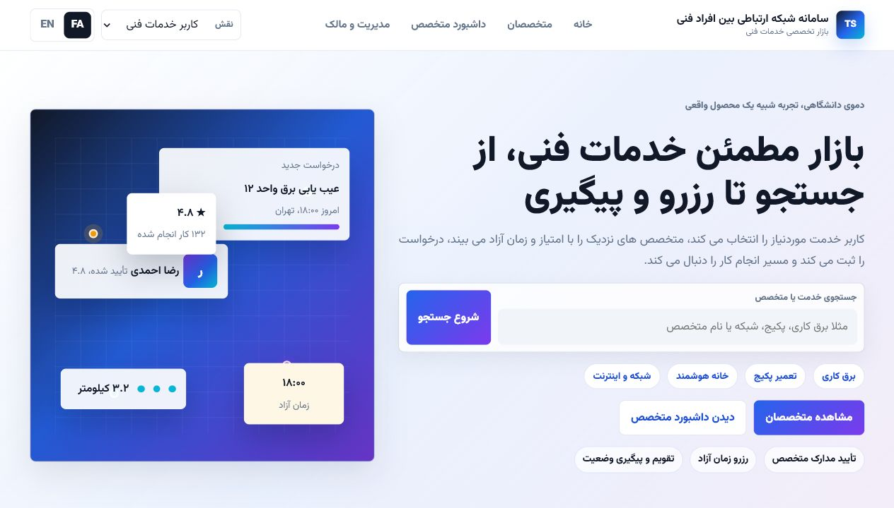
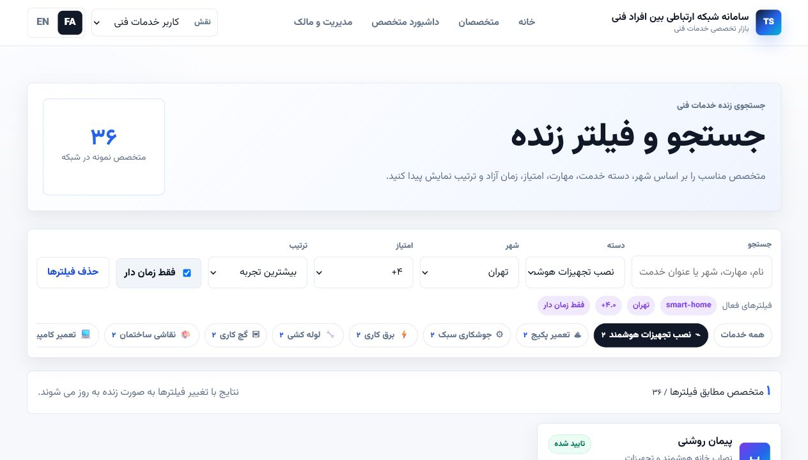
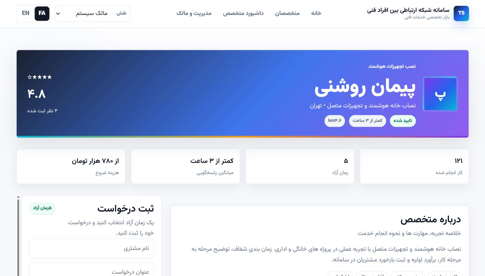

# Technical Service Network Demo

University demo project for **سامانه شبکه ارتباطی بین افراد فنی**. The app demonstrates a lightweight technical-service marketplace where customers discover specialists, filter profiles, reserve an available slot, export a calendar event, leave reviews, and track requests from a technician dashboard.

GitHub repository: <https://github.com/armankrgr/technical-service-network-demo>

## Stack

- Kotlin 1.9
- Spring Boot Web + Thymeleaf
- Local HTMX asset for partial updates
- Vanilla CSS and JavaScript
- In-memory sample data, no database

## Run

Use JDK 21. On this machine, keep the Gradle cache on the E: drive:

```powershell
cd E:\Project\technical-service-network-demo
$env:JAVA_HOME='C:\Program Files\Java\jdk-21'
$env:Path="$env:JAVA_HOME\bin;$env:Path"
$env:GRADLE_USER_HOME='E:\Project.gradle-cache'
.\gradlew.bat bootRun
```

Open `http://localhost:8080`.

## Build And Test

```powershell
cd E:\Project\technical-service-network-demo
$env:JAVA_HOME='C:\Program Files\Java\jdk-21'
$env:Path="$env:JAVA_HOME\bin;$env:Path"
$env:GRADLE_USER_HOME='E:\Project.gradle-cache'
.\gradlew.bat --no-daemon --console=plain clean build
```

## Demo Features

- Persian-first RTL UI with English LTR mode.
- Session-based role switch for Customer, Technician, Admin, and Owner.
- Premium marketplace home page with search, quick category chips, trust badges, stats, service visual, process section, trust/safety section, and Admin/Owner preview.
- 18 service categories, including smart-home equipment, boiler repair, and light welding.
- 36 sample technicians across multiple cities with varied verification, prices, response times, ratings, jobs, slots, skills, and reviews.
- Live search page with active filters, category chips, city/rating/availability/sort controls, HTMX-style loading state, empty state, and reset action.
- Marketplace listing cards with initials avatar, verified/pending badge, city/distance, rating, jobs, response time, starting price, open slots, and three skill chips.
- Specialist profile with cover header, rating summary, metrics, similar specialists, sticky scrollable booking panel, visual slot cards, reviews, and mobile booking CTA.
- Booking success card with request code, `.ics` download, Google Calendar link, dashboard link, toast, and lifecycle timeline.
- Technician dashboard with stats, request cards, status chips, request timeline, and accept/reject actions.
- Local JavaScript polish: mobile navigation, scroll-aware navbar, toast notifications, smooth anchor scroll, selected slot state, star rating state, count-up stats, mobile booking CTA, loading state, and double-submit protection.

## Font And Visual Direction

The UI uses a local `Vazirmatn-wght.woff2` font asset with the OFL license text saved in `src/main/resources/static/fonts/Vazirmatn-OFL.txt`. The fallback stack is:

```css
Vazirmatn, IRANSans, Dana, "Yekan Bakh", "Segoe UI", Tahoma, sans-serif
```

The color system moved away from the old green-heavy theme toward deep ink, soft gray/off-white surfaces, blue primary actions, cyan accents, purple premium highlights, amber ratings, and green only for success/status feedback.

## Demo Video Scenario

1. Start on the home page and introduce the system as a trusted technical-service marketplace.
2. Show the hero search, quick chips, trust badges, marketplace visual, and stats.
3. Switch FA / EN to demonstrate RTL and LTR behavior.
4. Use the role selector to explain Customer, Technician, Admin, and Owner actors.
5. Open `/technicians` and filter by category, city, rating, availability, and sort order.
6. Open a specialist profile and compare rating, response time, price, reviews, and similar specialists.
7. Select a slot, submit a booking, and show the success card plus request timeline.
8. Verify the `.ics` link and Google Calendar link.
9. Submit a review and show the updated reviews fragment.
10. Open the technician dashboard and accept/reject the request.
11. Return to the Admin/Owner section and connect the UI to the Systems Analysis story.

## Routes

- `/`
- `/technicians`
- `/technicians/results`
- `/technicians/{id}`
- `/technicians/{id}/book`
- `/technicians/{id}/reviews`
- `/technician/dashboard`
- `/requests/{id}/status`
- `/calendar/{requestId}.ics`

## Screenshots

- `screenshots/home.png`
- `screenshots/search.png`
- `screenshots/profile.png`
- `screenshots/booking-success.png`
- `screenshots/dashboard.png`
- `screenshots/admin-owner.png`
- `screenshots/mobile-home.png`
- `screenshots/mobile-profile.png`





## Known Limitations

This is an in-memory academic demo. It intentionally does not include production authentication, a database, payments, real GPS, SMS/email notifications, document upload, persistent storage, or real admin moderation tools. The goal is to demonstrate core Systems Analysis and Design workflows in a runnable, understandable, presentation-ready web app.
